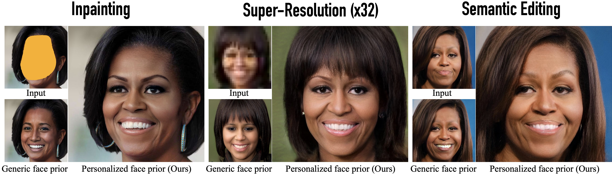
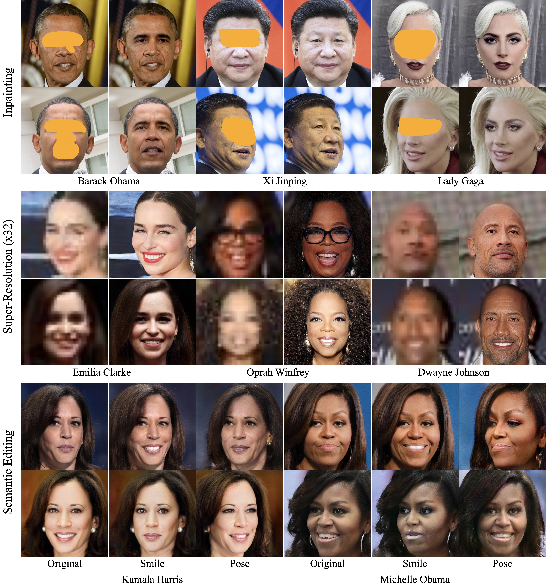

# MyStyle: A Personalized Generative Prior



### [Project Page](https://mystyle-personalized-prior.github.io/) | [Video](https://youtu.be/axWo_9Gt47o) | [Paper](https://arxiv.org/abs/2203.17272)

<!--- [](https://colab.research.google.com/github/bmild/nerf/blob/master/tiny_nerf.ipynb)<br> --->

[MyStyle: A Personalized Generative Prior](https://mystyle-personalized-prior.github.io/)  
 [Yotam Nitzan](https://yotamnitzan.github.io/)<sup>1,2</sup>, [Kfir Aberman](https://kfiraberman.github.io/)<sup>1</sup>, [Qiurui He](https://research.google/people/QiuruiCharlesHe/)<sup>1</sup>, [Orly Liba](https://sites.google.com/view/orly-liba)<sup>1</sup>, [Michal Yarom](michalyarom@google.com)<sup>1</sup>, [Yossi Gandelsman](https://yossi.gandelsman.com/)<sup>1</sup>,  [Inbar Mosseri](https://research.google.com/pubs/InbarMosseri.html)<sup>1</sup>, [Yael Pritch](https://research.google/people/106214/)<sup>1</sup>, [Daniel Cohen-Or](https://www.cs.tau.ac.il/~dcor/)<sup>2</sup> 

<sup>1</sup> Google Research, <sup>2</sup> Tel-Aviv University

## Setup

Code was tested with Python 3.9.5, Pytorch 1.9.0 and CUDA 11.4.

We provide a yml file to easy setup of a conda environment. 


```
conda env create -f mystyle_env.yml
```

Auxilary pre-trained models are required for some workflows and are listed below.

| Name                                                                                                      | Data Preprocessing | Training           | Description                                                                                    |
| --------------------------------------------------------------------------------------------------------- | ------------------ | ------------------ |:---------------------------------------------------------------------------------------------- |
| [arcface](https://drive.google.com/file/d/1KW7bjndL3QG3sxBbZxreGHigcCCpsDgn/view?usp=sharing)             | :heavy_check_mark: |                    | Face-recognition network taken from [TreB1eN](https://github.com/TreB1eN/InsightFace_Pytorch). |
| [dlib landmarks model](http://dlib.net/files/shape_predictor_68_face_landmarks.dat.bz2)                   | :heavy_check_mark: |                    | Used for face alignment.                                                                       |
| [FFHQ StyleGAN](https://nvlabs-fi-cdn.nvidia.com/stylegan2-ada-pytorch/pretrained/ffhq.pkl)               |                    | :heavy_check_mark: | StyleGANv2 model trained on FFHQ.                                                              |
| [W Inversion Encoder](https://drive.google.com/file/d/1M-hsL3W_cJKs77xM1mwq2e9-J0_m7rHP/view?usp=sharing) |                    | :heavy_check_mark: | Taken from [HyperStyle](https://github.com/yuval-alaluf/hyperstyle).                           |

## Getting Your Data Ready

We proivde a pre-processing pipeline so you can easily transform a personal photo album into a suitable training set. Start by having the photo album under a single local directory.

*Note*: Interactive scripts below require GUI / X-11.

#### Filtering other people and aligning faces

We first crop and align the faces in the photos. Naturally, besides the intended person, faces of other people may appear in the photo album. To filter them out run:

```
python data_preprocess/0_align_face.py \
    --images_dir /path/to/photo/album \
    --save_dir /path/to/save/resulting/images \
    --trash_dir /path/to/save/unused/images \
    --landmarks_model /path/to/dlib/landmarks/model \
    --id_model /path/to/arcface/model \
```

To learn who is the intended person, you will be prompted a few images of faces. If the face belongs to the intended person press *Y* to confirm. Press any other key otherwise. After having enough positive samples, we'll filter the rest of the images automatically.

If you are certain the photo album contains only the face of the desired person, you do not need to pass `--id_model` and the alignment is fully automatic.

#### Removing unsuitable images

From the resulting aligned set, we filter out unsuitable images if they are either low quality or grayscale. Run:

```
python data_preprocess/1_image_quality.py \
    --images_dir /path/to/aligned/faces \
    --save_dir /path/to/save/resulting/images \
    --trash_dir /path/to/save/unused/images
```

#### Removing Duplicates

Last, we'll remove duplicates from our set. To do that, run:

```
python data_preprocess/2_duplicates.py \
    --images_dir /path/to/current/filtered/images \
    --trash_dir /path/to/save/unsued/images \
    --id_model /path/to/arcface/model
```

All scripts have additional arguments that could be tuned to make the pipeline more accurate. Nevertheless, it will never be perfect. Specifically, you'd probably like to apply additional filters, depending on your data. We recommend using lenient values for the scripts above (such as those set as default) and following up with a manual filtering:

```
python data_preprocess/3_manual_filter.py \
    --images_dir /path/to/current/filtered/images \
    --trash_dir /path/to/save/unsued/images
```

Note that low quality images will degrade the quality of the generator!

## Training a Personalized Generator

To adapt a pretrained domain-generator to a personalized-generator, run the training command below.

```
python train.py \
    --images_dir /path/to/dir/of/ready/training/images \
    --output_dir /path/to/save/results \
    --generator_path /path/to/pretrained/domain-generator \
    --encoder_checkpoint /path/to/pretrained/inversion/encoder 
```

Anchors will be inferred on-the-fly and saved under the output_dir. 

To use existing saved anchors for the training images, pass `--anchor_dir` instead of `--encoder_checkpoint`. Customize hyperparameters by editing `hyperparams.py` file.

Training is expected to take ~50 seconds per training image on a single V100.

## Test time - Applications

### Image Synthesis

To generate personalized images:

```
python generate.py \
    --generator_path /path/to/personalized/generator \
    --output_path /path/to/save/results \
    --anchors_path /path/to/models_anchors
```

### Image Enhancement & Inversion

First, align the test images using `data_preprocess/0_align_face.py`.

Our image enhancement method is based on projecting the image into the latent space of the generator, similarly to inversion.  Therefore, inversion and image enhancemnet applications - inpainting and super-resolution are run using very similar code.

**For inversion:**

```
python project.py \
    --images_dir /path/to/dir/of/test/images \
    --output_dir /path/to/save/results \
    --anchor_dir /path/to/models_anchors \
    --generator_path /path/to/personalized/generator
```

**For inpainting**, add `--mask_dir /path/to/dir/of/masks` 

**For super-resolution**, add  `--sr_factor /zero/to/one/downscaling/factor`

##### Importance of $\beta$

In our experiments, we found that $\beta$ (controlled with `--beta`) controls the trade-off between prior and fidelity. Depending on how "atypical" is the input image - increasing $\beta$ may lead to lower-distortion projection at the cost of being less faithful to the prior. See paper for more details.

### Semantic Editing

To edit real images you first need to reconstuct them from MyStyle's latent space. The first step is to use "plain" inversion, with `project.py`. To improve reconstruction, you can further tune the generator on the test images (as in [PTI](https://github.com/danielroich/PTI)), using `train.py`. Adding the second stage requires more time but it obtaines significantly better quality.

Last, with the inverted alphas and generator in hand, run the edit script:

```
python edit.py \
    --alphas_dir /path/to/alpha/results/of/projection \
    --output_dir /path/to/save/results \
    --anchor_dir /path/to/models_anchors \
    --generator_path /path/to/personalized/generator \
    --editing_direction_path /path/to/dir/with/W/editing/directions
```

An example script with the entire editing pipeline is provided under `editing_pipeline.sh`.

##### Editing Directions:

Any W editing direction should work in principle. The InterFaceGAN directions used in the paper (taken from [PTI](https://github.com/danielroich/PTI)) are provided in `editing_directions` for your convinienve. Thanks to the [AnyCost GAN](https://tinyml.mit.edu/projects/anycost-gan/) team - directions corresponding to all labels of CelebA can be found [here](https://tinyml.mit.edu/projects/anycost-gan/files/boundary_stylegan2-ffhq-config-f.pt). 

## Results



## Citation

```
@article{nitzan2022mystyle,
  title={MyStyle: A Personalized Generative Prior},
  author={Nitzan, Yotam and Aberman, Kfir and He, Qiurui and Liba, Orly and Yarom, Michal and Gandelsman, Yossi and Mosseri, Inbar and Pritch, Yael and Cohen-Or, Daniel},
  journal={arXiv preprint arXiv:2203.17272},
  year={2022}
}
```

## Disclaimer

This is not an officially supported Google product.
